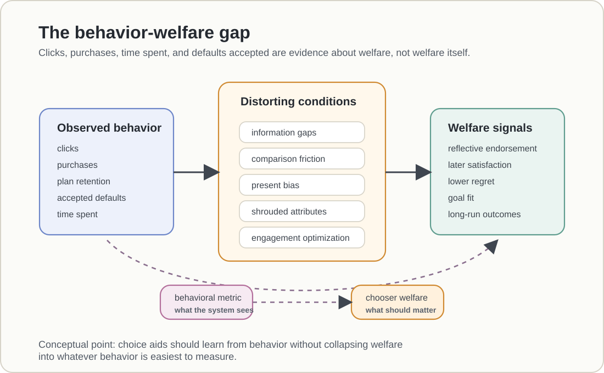

# Behavior-Welfare Gap

## Core idea

The [[Behavior-Welfare Gap]] is the gap between what people do in a choice environment and what would actually make them better off by their own lights. It is the reason [[Chooser Welfare]] cannot be inferred mechanically from clicks, purchases, defaults accepted, time spent, plan retention, or engagement.

The concept is central to [[AI as Choice Aid]] because AI systems often learn from behavior. If behavior is a noisy or biased signal of welfare, then a system that predicts or optimizes behavior may reproduce mistakes rather than repair them.

Figure BWG.1 gives the core warning. Observed behavior is a useful signal, but it passes through distorting conditions before it can be treated as evidence of welfare. A choice aid therefore needs more than behavioral prediction if it is going to help rather than merely optimize what is easiest to measure.

<figure class="wiki-figure">
  
  <figcaption><strong>Figure BWG.1.</strong> Behavior is not welfare. Clicks, purchases, retention, default acceptance, and time spent can diverge from reflective endorsement, later satisfaction, lower regret, goal fit, and long-run outcomes.</figcaption>
</figure>

## Main forms

- Informational gaps: users choose without knowing material facts or consequences.
- Comparison gaps: information exists, but the user does not find, process, compare, or act on it.
- Competence gaps: users misunderstand the structure of the choice, as in health insurance cost-sharing.
- Intertemporal gaps: present-biased choices impose costs on future selves.
- Attention gaps: salient, fluent, or numeric information receives too much weight.
- Strategic gaps: firms shroud attributes or design interfaces that exploit predictable mistakes.
- Engagement gaps: a platform observes more use, even when the user experiences regret or lower reflective utility.

## Evidence and debate

The gap appears even when people actively choose. In health insurance, employees can select plans that are financially dominated by equivalent alternatives; Bhargava and coauthors document this severe active-choice version in [[Bhargava et al., 2017|Choose to Lose]].

The gap also appears when information is available but not usable. Passive access to personalized cost information may not be enough; delivering it in a way that lowers comparison friction ([[Smart Disclosure]]) can change plan switching and costs, as Kling and coauthors show in [[Kling et al., 2012|Comparison Friction]].

The market version is strategic. Firms can profit from consumer myopia by shrouding fees, add-ons, or other welfare-relevant attributes, and competition may not force unshrouding. Gabaix and Laibson supply that mechanism in [[Gabaix and Laibson, 2006|Shrouded Attributes]].

The information-format version is attentional. Numeric information can be easier to compare than qualitative information, so users may overweight what is counted and underweight what matters but is harder to quantify. The result is a choice that looks informed while still failing to track welfare. Chang and coauthors analyze this as quantification fixation in [[Chang et al., 2024|Quantification Fixation]].

The platform version is especially important for digital nudging. Engagement can rise while welfare falls when users have inconsistent preferences or later regret; Kleinberg and coauthors make this point in [[Kleinberg et al., 2023|The Challenge of Understanding What Users Want]]. This is why the behavior-welfare gap becomes a case for AI choice engines: assistance is most plausible where behavior is predictably distorted and where the aid can help the user decide under better conditions, as Sunstein argues in [[Sunstein, 2023|Behavioral Biases, Choice Engines, and Paternalistic AI]].

## Practical or policy relevance

Digital nudging should treat behavioral data as evidence, not as welfare itself. Good choice aids need additional signals: explicit goals, later satisfaction, regret, long-run outcomes, counterfactual comparisons, transparency, reversibility, and user endorsement after explanation.

The danger is symmetrical. If AI systems use behavior as the target, they can amplify impulsive or manipulated behavior. If they use reflective welfare as the target, they can help people navigate complex and adversarial choice environments.

## Related pages

- [[AI as Choice Aid]]
- [[Chooser Welfare]]
- [[Algorithmic Thought Partners]]
- [[Recommendation Systems]]
- [[Shrouded Attributes]]

## Open questions

What evidence should be required before a digital choice aid can claim that it improves welfare rather than merely improves a behavioral metric?
