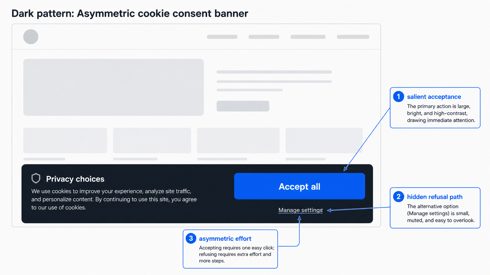
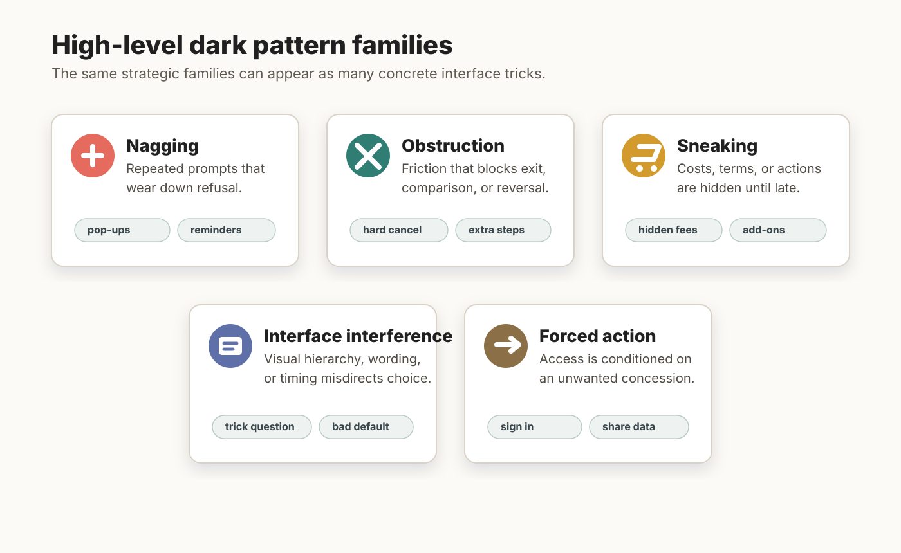
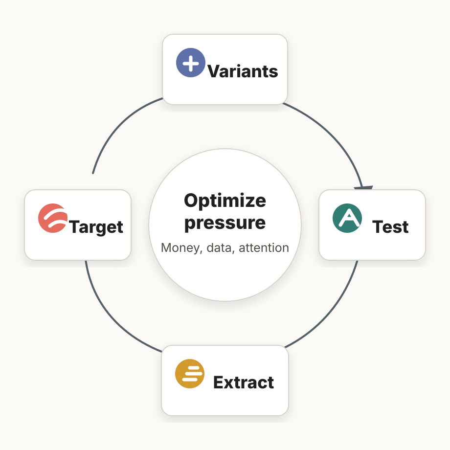

# Dark Patterns

## Core idea

[[Dark Patterns]] are interface designs that steer users toward outcomes they would not reasonably choose under clearer, less pressured, or less asymmetric conditions. They are closely related to [[Sludge]] and [[Manipulation]], but the emphasis is on recurring digital design patterns that benefit the service by coercing, steering, deceiving, burdening, or confusing users.

For the vault, dark patterns are the negative counterpart of user-serving [[Digital Nudging]]. They use the tools of [[Choice Architecture]] to serve the architect against the user's reflective interests. In that sense, the former concept "adversarial choice architecture" is now treated as the strategic orientation of dark patterns rather than as a separate page.

## What makes them dark

The "darkness" is not just that a pattern changes behavior. [[Nudge|Nudges]] also change behavior. The key issue is the relationship between mechanism and objective:

- the design modifies the user's decision space or information flow;
- the design benefits the service, seller, or platform;
- the user is made less able to understand, refuse, compare, reverse, or exit;
- the outcome is plausibly contrary to the user's welfare, autonomy, privacy, or actual preference.

This is why [[Sludge]] is a method rather than the definition. Obstruction, cancellation mazes, and hard-to-refuse consent flows often work through sludge, but other dark patterns work through urgency, scarcity, social proof, hidden information, bad defaults, trick questions, emotional pressure, or forced disclosure. Figure DP.1 gives a schematic example of this asymmetry in a cookie-consent interface.

<figure class="wiki-figure">
  
  <figcaption><strong>Figure DP.1.</strong> Asymmetric cookie-consent banner. The interface preserves formal choice while distorting practical choice: acceptance is salient and easy, while refusal is muted, indirect, or effortful.</figcaption>
</figure>

## Representative patterns

The former dark-pattern taxonomy page is now folded into this section. The literature supplies several overlapping taxonomies:

- [[Gray et al., 2018|Gray et al.]] identify nagging, obstruction, sneaking, interface interference, and forced action.
- [[Mathur et al., 2019|Mathur et al.]] identify e-commerce categories including sneaking, urgency, misdirection, social proof, scarcity, obstruction, and forced action.
- [[Gray et al., 2024|Gray et al.]] harmonize the field into high-level, meso-level, and low-level patterns, with obstruction, sneaking, interface interference, forced action, and social engineering as high-level families.

Examples include hidden costs, hidden subscriptions, sneak into basket, countdown timers, low-stock messages, fake or misleading social proof, confirmshaming, trick questions, visual interference, bad defaults, forced enrollment, forced continuity, Privacy Zuckering, and hard-to-cancel flows.

Figure DP.2 should be read as a map of recurring families, not as a claim that every case belongs cleanly to one box. A single checkout flow, for example, can combine sneaking, obstruction, and interface interference.

<figure class="wiki-figure">
  
  <figcaption><strong>Figure DP.2.</strong> High-level dark pattern families. The figure compresses recurring taxonomies into five strategic families and gives quick examples of the interface moves that instantiate them.</figcaption>
</figure>

## Empirical and institutional significance

Dark patterns matter institutionally because they are not isolated design accidents. They are empirically widespread in online shopping and can be supplied by third-party vendors, which makes them a platform and market-structure problem. Mathur and coauthors provide the large-scale evidence in [[Mathur et al., 2019|Dark Patterns at Scale]].

They also have a history. Narayanan and coauthors connect dark patterns to older retail deception, behavioral nudging, and Silicon Valley growth hacking in [[Narayanan et al., 2020|Dark Patterns: Past, Present, and Future]]. That genealogy helps explain why the field moves between consumer protection, interface design, behavioral science, and platform governance.

They also have causal force. The course should pay special attention to mild dark patterns because they can substantially change behavior while avoiding the backlash associated with aggressive manipulation. Luguri and Strahilevitz's first experiment in [[Luguri and Strahilevitz, 2021|Shining a Light on Dark Patterns]] is the key anchor for that point.

## Relationship to hypernudging

<figure class="wiki-figure wiki-figure--right">
  
  <figcaption><strong>Figure DP.3.</strong> Extraction-oriented optimization loop. Digital dark patterns can be tested, measured, personalized, and redeployed around money, data, and attention.</figcaption>
</figure>

Yeung's [[Hypernudge]] account helps explain why dark patterns can become more powerful in data-driven systems. A static deceptive interface is already troubling. Figure DP.3 shows the digital escalation: a continuously optimized and personalized dark pattern can learn which version works on which users, when to deploy it, and how to hide its mechanism inside normal platform operation.

Adaptive armor ([[Algorithmic Thought Partners]]) is the constructive countermeasure: user-serving algorithms can help identify, translate, and neutralize shrouded attributes or confusing design choices. Ludwig and coauthors' [[Ludwig et al., 2025|Algorithms as a Vehicle to Reflective Equilibrium: Behavioral Economics 2.0]] supplies that positive alternative to extraction-oriented optimization.

## Normative and legal stakes

The normative question is not exhausted by one harm. Dark patterns can be evaluated through individual welfare, collective welfare, regulatory objectives, and autonomy, because they can cause financial loss, privacy invasion, cognitive burden, reduced competition, invalid consent, or loss of practical self-authorship. Mathur and coauthors develop this multi-lens account in [[Mathur et al., 2021|What Makes a Dark Pattern... Dark?]].

The former dark-pattern regulation page is now folded into this section. The regulatory question is when those harms should trigger legal responses under consumer protection, data protection, privacy, contract, or competition law. The problem is that formal consent or formal choice may remain intact even when the interface architecture has made that choice practically distorted.

## Course use

For teaching, dark patterns should be introduced with a few vivid examples but then generalized. The core lesson is not that countdown timers or cancellation mazes are bad in isolation. The core lesson is that digital choice architecture can be optimized for extraction. Money, data, and attention become the resources captured by designs that exploit automatic cognition, inattention, trust, urgency, social pressure, and fatigue.

## Related pages

- [[Sludge]]
- [[Manipulation]]
- [[Dark Patterns as Adversarial Choice Architecture]]
- [[Hypernudge]]
- [[Personalized Choice Architecture]]
- [[Privacy and Consent]]
- [[Digital Nudging]]

## Open questions

How should the course distinguish aggressive but legitimate persuasion from dark patterns when platforms can personalize pressure and test compliance at scale?
