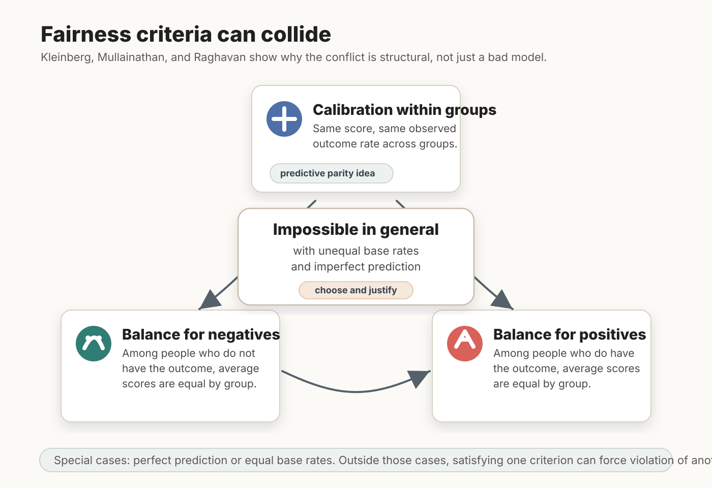
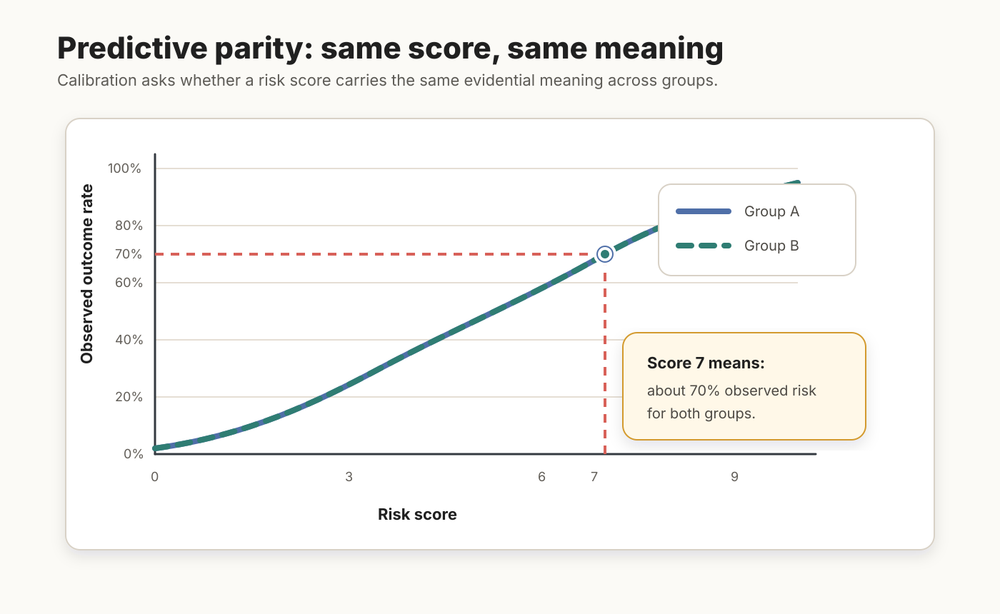
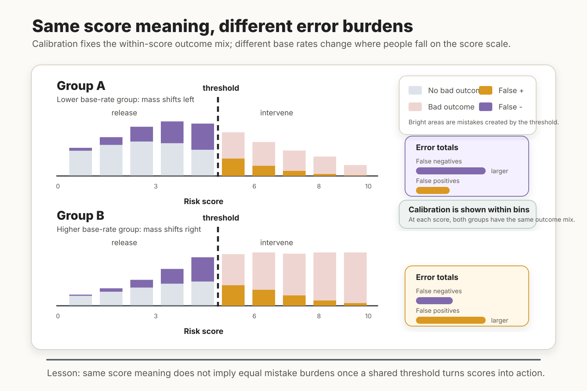

# Fairness Impossibility Results

## Core idea

[[Fairness Impossibility Results]] show that multiple plausible fairness conditions for algorithmic prediction cannot generally be satisfied at once. The foundational result currently in the vault is Kleinberg, Mullainathan, and Raghavan's theorem for risk scores: with unequal base rates and imperfect prediction, calibration within groups cannot be combined with balance for both the negative and positive classes.

Figure FIR.1 gives the basic structure. The point is not that one model happened to fail. The point is that, outside narrow special cases, some fairness demands pull against one another.

<figure class="wiki-figure">
  
  <figcaption><strong>Figure FIR.1.</strong> Fairness criteria can collide. With unequal base rates and imperfect prediction, calibration within groups cannot generally be combined with balance for both the positive and negative classes.</figcaption>
</figure>

## Key distinctions

- Structural impossibility is not the same as practical difficulty. The theorem says that some combinations of fairness demands are mathematically incompatible outside special cases.
- The special cases are narrow: perfect prediction or equal base rates across groups.
- The impossibility concerns fairness conditions for scores, not only binary decisions.
- Impossibility does not imply ethical paralysis. It implies that institutions must choose and justify which fairness demand matters most in context.

## Predictive parity and error-rate parity

Predictive parity is the idea that a prediction should have the same evidential meaning across groups. For risk scores, this is closely related to calibration within groups: people assigned the same score should have the same observed outcome rate regardless of group membership.

Figure FIR.2 isolates that idea. If a score of 7 means about the same observed risk in each group, then the score is not changing its evidential meaning when applied to different groups.

<figure class="wiki-figure">
  
  <figcaption><strong>Figure FIR.2.</strong> Predictive parity as same score meaning. Calibration asks whether a given risk score corresponds to the same observed outcome rate across groups.</figcaption>
</figure>

Error-rate parity asks a different question: whether the practical burdens of mistakes fall similarly across groups. In the COMPAS debate, this means asking whether false positives and false negatives are distributed unequally across Black and white defendants.

Figure FIR.3 shows why this is a separate question. The red-blue mix within each score bin is held constant across groups to represent calibration: the same score has the same observed meaning. The groups differ in where their members fall on the score scale. Once a shared threshold is imposed, the lower-base-rate group has more false negatives below the threshold, while the higher-base-rate group has more false positives above it. The right-hand bars summarize those total error burdens, so the reader does not have to infer them by visually summing the colored histogram areas. That is the COMPAS-style direction of error.

<figure class="wiki-figure">
  
  <figcaption><strong>Figure FIR.3.</strong> Same score meaning, different error burdens. Calibration fixes the within-score outcome mix, but different base rates change the distribution of people across score bins; after a threshold is applied, false negatives and false positives can fall unevenly across groups. The right-side bars summarize the total error burdens for each group.</figcaption>
</figure>

The impossibility result matters because both ideas are attractive, but they cannot generally be satisfied together when base rates differ and prediction is imperfect.

## Evidence and debate

The formal impossibility result matters because it explains why the COMPAS debate could not be resolved by finding the one correct metric. ProPublica-style error-rate critiques and Northpointe-style calibration defenses can each appeal to a plausible fairness idea while talking past each other. Kleinberg, Mullainathan, and Raghavan formalize this result in [[Kleinberg et al., 2016|Inherent Trade-Offs in the Fair Determination of Risk Scores]].

One response is to give calibration a special status. Predictive parity ([[Fairness Impossibility Results]]) preserves the evidential meaning of a score across groups, and Hedden argues that many non-calibration criteria are not necessary for fair prediction. His coin-and-rooms example in [[Hedden, 2021|On Statistical Criteria of Algorithmic Fairness]] is meant to show that a fair and uniquely optimal predictor can violate error-rate and statistical-parity criteria even when base rates are equal.

The competing response is to emphasize error burdens. Preserving evidential meaning is not enough if action, treatment, and legal burden depend on mistakes. Hellman treats predictive parity as epistemic and error rate parity ([[Fairness Impossibility Results]]) as pragmatic in [[Hellman, 2020|Measuring Algorithmic Fairness]].

The broader lesson is that impossibility results create philosophical work rather than merely technical work. If metrics conflict, the appropriate response is to ask which egalitarian, anti-discrimination, or representational ideal should govern the domain. Binns develops that normative turn in [[Binns, 2018|Fairness in Machine Learning: Lessons from Political Philosophy]].

The result also sets up later normative readings. Once the metrics conflict, the next question is not only "which metric is mathematically correct?" but "which error, burden, right, or institutional goal should govern this setting, and is the unfairness in the prediction, the decision rule, or the surrounding institution?"

## Practical or policy relevance

For digital nudging, impossibility results are a warning against treating fairness as a post-hoc technical patch. If recommender systems, targeting engines, predictive models, or eligibility scores optimize one fairness criterion, they may worsen another. Designers and regulators need an explicit account of the decision context, the affected parties, and the cost of different errors.

## Related pages

- [[Kleinberg et al., 2016|Inherent Trade-Offs in the Fair Determination of Risk Scores]]
- [[Hedden, 2021|On Statistical Criteria of Algorithmic Fairness]]
- [[Hellman, 2020|Measuring Algorithmic Fairness]]
- [[Binns, 2018|Fairness in Machine Learning: Lessons from Political Philosophy]]
- [[Algorithmic Fairness]]
- [[Algorithmic Fairness]]
]]]
## Open questions

How should this page incorporate later impossibility results and critiques without turning into a purely technical taxonomy?
